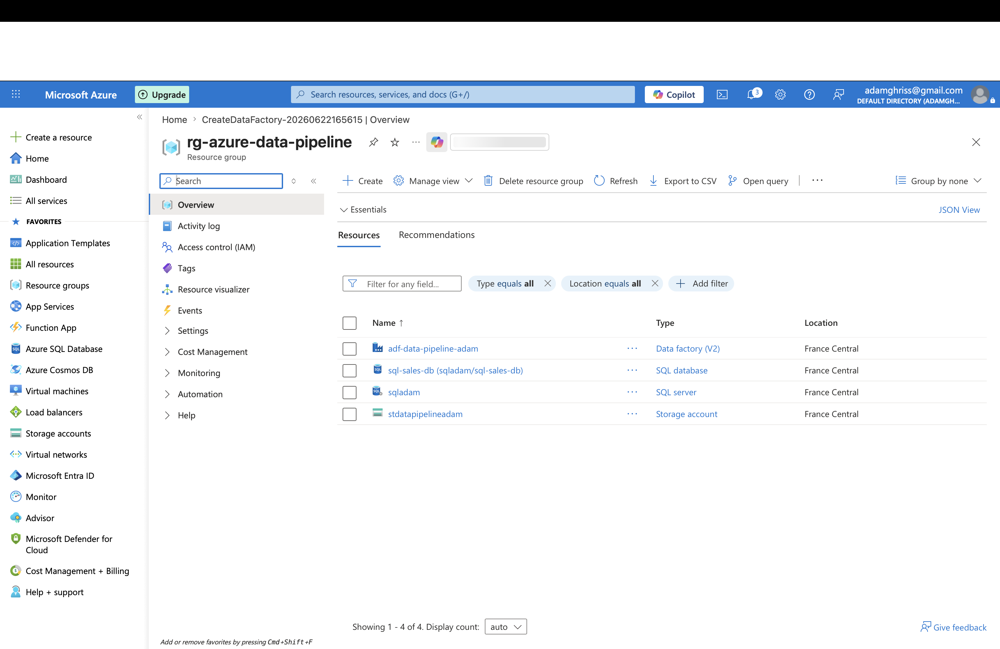
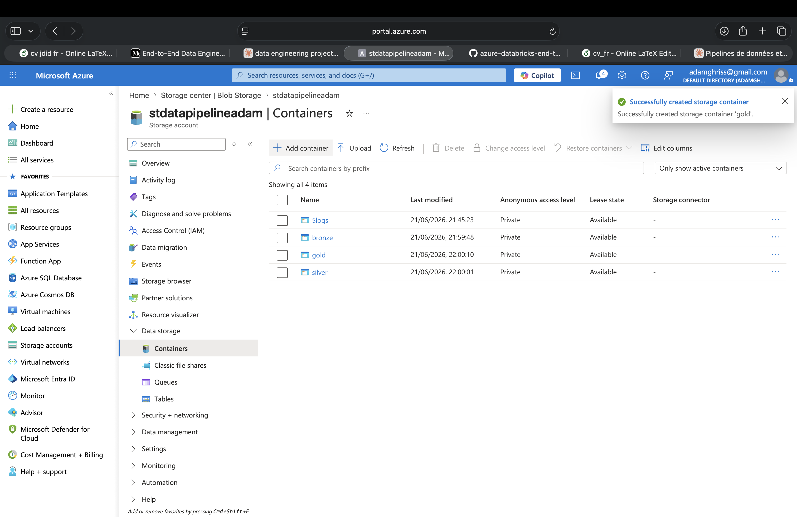
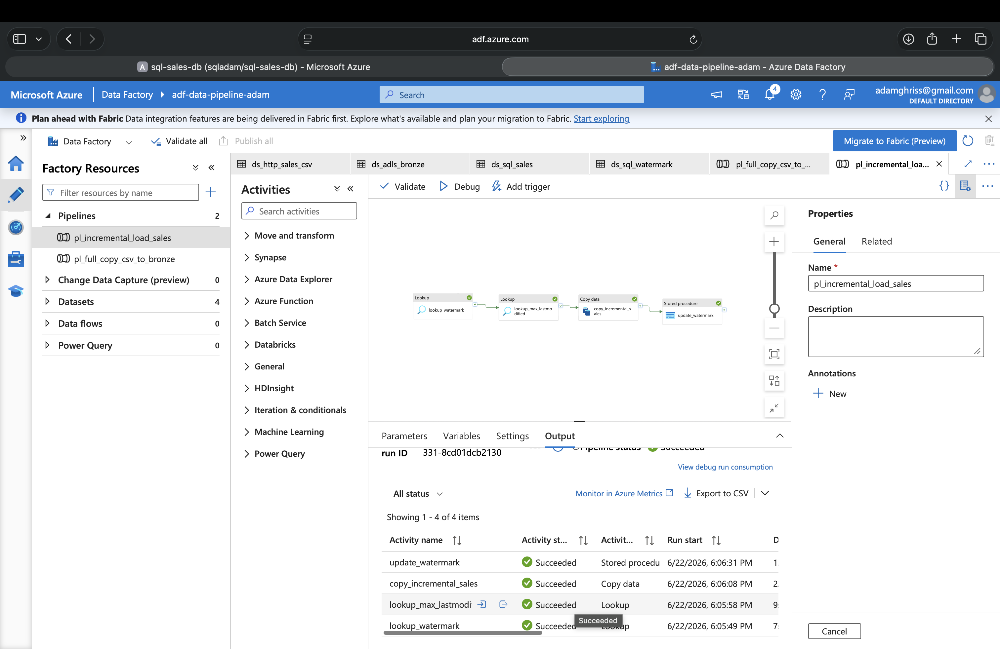
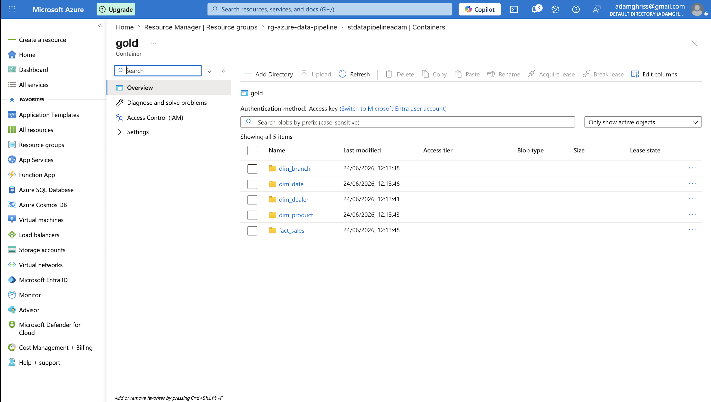
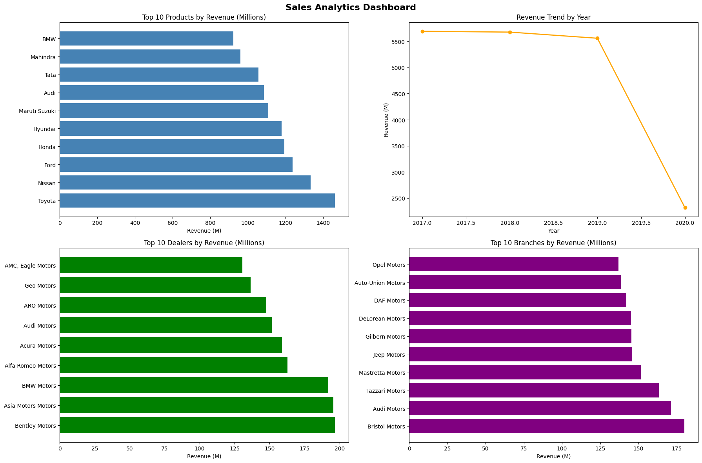

# Azure End-to-End Data Engineering Pipeline

A production-style incremental data pipeline built entirely on Azure, following the **Medallion Architecture** (Bronze → Silver → Gold). The pipeline ingests raw car sales data, transforms it into a star schema, and surfaces business insights through an analytics dashboard.

---

## Architecture

```
GitHub (SalesData.csv)
        │
        ▼
┌─────────────────────────────────────────────────────┐
│              Azure Data Factory (ADF)               │
│   Pipeline 1: Full Copy  │  Pipeline 2: Incremental │
│   (CSV → Bronze)         │  (CDC Watermark-based)   │
└─────────────┬────────────┴────────────┬─────────────┘
              │                         │
              ▼                         ▼
┌─────────────────────────────────────────────────────┐
│         Azure Data Lake Storage Gen2                │
│  ┌──────────┐  ┌──────────┐  ┌──────────────────┐  │
│  │  Bronze  │  │  Silver  │  │       Gold       │  │
│  │ Raw CSV  │  │ Cleaned  │  │   Star Schema    │  │
│  │          │  │  Delta   │  │     Delta        │  │
│  └──────────┘  └──────────┘  └──────────────────┘  │
└─────────────────────────────────────────────────────┘
              │                         │
              ▼                         ▼
┌─────────────────────┐   ┌─────────────────────────┐
│   Azure SQL DB      │   │  Azure Databricks        │
│  - sales table      │   │  - Bronze → Silver       │
│  - watermark table  │   │  - Silver → Gold         │
│  - CDC stored proc  │   │  - Star schema modeling  │
└─────────────────────┘   └────────────┬────────────┘
                                        │
                                        ▼
                          ┌─────────────────────────┐
                          │  Databricks Dashboard   │
                          │  - Revenue by Product   │
                          │  - Revenue by Year      │
                          │  - Top Dealers          │
                          │  - Top Branches         │
                          └─────────────────────────┘
```

---

## Tech Stack

| Layer | Technology |
|---|---|
| Orchestration | Azure Data Factory (ADF V2) |
| Storage | Azure Data Lake Storage Gen2 |
| Database | Azure SQL Database |
| Transformation | Azure Databricks + PySpark |
| File Format | Delta Lake |
| Visualization | Databricks Dashboard (matplotlib) |
| Version Control | GitHub (ADF Git integration) |

---

## Screenshots

### Infrastructure — Resource Group
All Azure resources provisioned inside a single resource group for easy management and teardown.



### Storage — Medallion Architecture Containers
Three containers implementing the Bronze/Silver/Gold architecture, all set to Private access.



### ADF — Incremental Pipeline (4 activities)
The watermark-based CDC pipeline: Lookup watermark → Lookup max timestamp → Copy incremental rows → Update watermark.



### Databricks — Gold Layer (Star Schema)
Five Delta tables written to the Gold container: `fact_sales`, `dim_branch`, `dim_dealer`, `dim_product`, `dim_date`.



### Analytics Dashboard
Four charts built on top of the Gold layer using PySpark + matplotlib.



---

## Project Structure

```
azure-data-pipeline-project/
│
├── dataset/                    # ADF dataset definitions (auto-generated)
├── factory/                    # ADF factory settings (auto-generated)
├── linkedService/              # ADF linked service configs (auto-generated)
├── pipeline/                   # ADF pipeline JSON definitions
│   ├── pl_full_copy_csv_to_bronze.json
│   └── pl_incremental_load_sales.json
│
├── notebooks/
│   ├── 01_mount_adls.py        # ADLS Gen2 connection setup
│   ├── 02_bronze_to_silver.py  # Cleaning & transformation
│   ├── 03_silver_to_gold.py    # Star schema modeling
│   └── 04_gold_analysis.py     # Analytics & dashboard
│
├── screenshots/                # Project screenshots for documentation
├── publish_config.json
└── README.md
```

---

## Pipeline Details

### Pipeline 1: Full Copy (GitHub CSV → Bronze)
- Reads raw `SalesData.csv` (1,849 rows) from GitHub via HTTP linked service
- Lands it as-is into the `bronze` container in ADLS Gen2
- One-time historical load

### Pipeline 2: Incremental Load (Watermark-based CDC)
A 4-activity pipeline that implements Change Data Capture:

1. **Lookup Watermark** — reads the last loaded timestamp from `dbo.watermark`
2. **Lookup Max LastModified** — gets the current max `last_modified` from `dbo.sales`
3. **Copy Incremental** — copies only rows where `last_modified > watermark`
4. **Update Watermark** — calls `dbo.update_watermark` stored procedure to advance the watermark

Proven by inserting 3 new rows and confirming exactly **3 rows loaded** on the next pipeline run — not 8.

---

## Data Transformation (Databricks)

### Bronze → Silver (`02_bronze_to_silver.py`)
- Reads raw CSV from Bronze container
- Trims whitespace from string columns
- Casts `Revenue` to `long`, `Units_Sold` to `integer`
- Combines `Day`, `Month`, `Year` into a proper `Date` column using `try_to_date` (handles invalid dates gracefully — 1 bad date found, set to NULL)
- Drops redundant date columns and duplicates
- Writes clean data to Silver container as **Delta format**

### Silver → Gold (`03_silver_to_gold.py`)
Models the cleaned data into a **star schema**:

| Table | Rows | Description |
|---|---|---|
| `fact_sales` | 1,848 | Revenue, units sold, foreign keys |
| `dim_branch` | 1,836 | Branch ID and name |
| `dim_dealer` | 267 | Dealer ID and name |
| `dim_product` | 36 | Product name with MD5 surrogate key |
| `dim_date` | 942 | Distinct sale dates |

All tables written to Gold container as **Delta format**.

---

## Analytics Dashboard

Built using PySpark + matplotlib on top of the Gold layer:

| Chart | Insight |
|---|---|
| Top 10 Products by Revenue | Toyota leads at ~1.4B |
| Revenue Trend by Year | Steady 2017–2019, sharp drop in 2020 |
| Top 10 Dealers by Revenue | Bentley Motors leads at ~200M |
| Top 10 Branches by Revenue | Bristol Motors leads at ~175M |

---

## Setup & Reproduction

### Prerequisites
- Azure account (free trial works — ~$15–20 in credits consumed)
- GitHub account

### Azure Resources Required

| Resource | Name | Region |
|---|---|---|
| Resource Group | `rg-azure-data-pipeline` | France Central |
| Storage Account (ADLS Gen2) | `stdatapipelineadam` | France Central |
| Azure SQL Database | `sql-sales-db` | France Central |
| Azure Data Factory | `adf-data-pipeline-adam` | France Central |
| Azure Databricks | `dbw-data-pipeline-adam` | North Europe |

> Note: Databricks was deployed in North Europe due to VM capacity constraints in France Central on the free trial.

### Steps
1. Create all Azure resources listed above
2. Create `bronze`, `silver`, `gold` containers in ADLS Gen2 (all Private access)
3. Run SQL scripts to create `sales` and `watermark` tables in Azure SQL DB
4. Configure ADF linked services (SQL DB, ADLS Gen2, HTTP/GitHub)
5. Create ADF datasets and import pipelines from this repo
6. In Databricks, set storage account key in cluster **Spark config** (Advanced settings)
7. Run notebooks in order: `01` → `02` → `03` → `04`

### Important: Secrets Management
Never hardcode credentials in notebooks or commit them to GitHub:
- Store ADLS access key in Databricks cluster **Spark config** only
- ADF credentials managed via Azure linked service authentication
- Rotate keys immediately if accidentally exposed

---

## Key Concepts Demonstrated

- **Medallion Architecture** (Bronze/Silver/Gold)
- **Change Data Capture (CDC)** with watermark-based incremental loading
- **Star schema modeling** (fact + dimension tables)
- **Delta Lake** for ACID-compliant storage
- **PySpark** transformations at scale
- **Surrogate key generation** using MD5 hashing
- **Data quality handling** (null dates, type casting, deduplication)
- **CI/CD**: ADF pipelines version-controlled via GitHub integration
- **Cost management**: Budget alerts + auto-terminating Databricks cluster

---

## Source Data

Car sales dataset from [RihabFekii's Azure Databricks End-to-End Project](https://github.com/RihabFekii/azure-databricks-end-to-end-project)

- 1,849 rows of car sales transactions
- Columns: Branch, Dealer, Model, Revenue, Units Sold, Date, Product
- Years covered: 2017–2020
